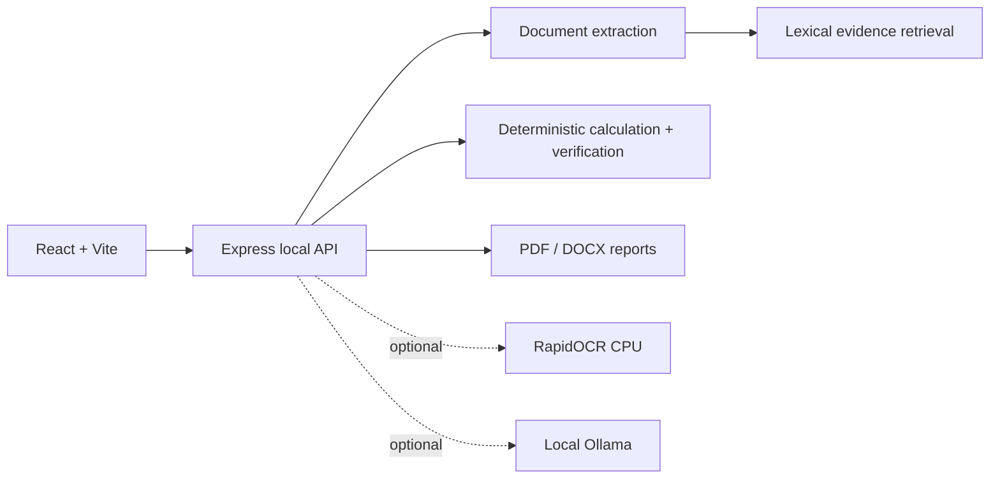

# Sovereign AI Workbench

Local-first document analysis and reporting for sensitive operational
information. The workbench keeps the demo and core processing on the local
machine, makes source evidence visible, and performs supported calculations
deterministically instead of asking a language model to do arithmetic.

> **Status:** early release. This repository contains a working demo and
> partial local document-analysis pipeline. It is not a certified engineering,
> compliance, or safety approval system.

## Why this exists

Teams handling inspection reports, manuals, drawings, and equipment registers
often need traceable answers without uploading sensitive files to a hosted AI
service. Sovereign AI Workbench is intended for local development and
experimentation on constrained hardware such as an RTX 3050 6 GB GPU with
approximately 12 GB system RAM.

## What is implemented

- React/Vite workbench UI with local API health display, upload flow, job
  polling, demo mode, and report links.
- Express API with file-size/type validation and temporary upload cleanup.
- Extraction for CSV, XLSX, DOCX, and machine-readable PDF files.
- PNG/JPG OCR adapter through optional RapidOCR ONNX on CPU.
- In-memory lexical evidence retrieval with source-block references.
- Deterministic pressure/maximum-pressure calculation and verification guards.
- Demo analysis explicitly labelled `DEMO / SIMULATION MODE`.
- PDF and DOCX report generation.
- Optional local Ollama reasoning and vision adapters.

## Partial or planned

- Scanned-PDF page rendering and OCR is not implemented.
- The current retrieval index is lexical and in-memory, not embeddings or a
  persistent knowledge base.
- Job history is lost when the API restarts.
- Vision analysis is an adapter and requires a locally installed Ollama vision
  model; it is not part of the automated tests.
- Authentication, multi-user access control, persistent storage, and
  production deployment hardening are planned.

## Architecture



See [docs/ARCHITECTURE.md](docs/ARCHITECTURE.md) for runtime boundaries.

## Technology stack

- JavaScript, React, Vite, and CSS
- Node.js, Express, Multer, PDFKit, `pdf-parse`, Mammoth, and SheetJS
- Vitest, Supertest, and ESLint
- Optional Python RapidOCR ONNX runtime
- Optional Ollama local HTTP API

## Requirements

- Node.js LTS and npm
- Windows PowerShell commands are shown below; equivalent commands work on
  other platforms with adjusted activation syntax.
- Python 3.10+ only for image OCR
- Optional: Ollama and local model storage
- Suggested constrained profile: RTX 3050 6 GB VRAM and about 12 GB RAM

Large model weights and caches are intentionally not tracked in Git.

## Installation and configuration

From the repository's `WEB` directory:

```powershell
npm install
Copy-Item .env.example .env
```

For optional OCR:

```powershell
py -m venv .venv
.\.venv\Scripts\Activate.ps1
python -m pip install -r requirements.txt
```

`.env.example` documents the server port, upload limit, local Ollama URL and
model names, CORS origin, and the Vite API base URL. The defaults use
`qwen2.5:3b` for reasoning and `qwen2.5vl:3b` for vision so that sequential
model requests are more realistic for a 6 GB GPU. Install Ollama separately,
then:

```powershell
ollama serve
ollama pull qwen2.5:3b
ollama pull qwen2.5vl:3b
```

Ollama and model downloads are optional for the demo and automated tests.

## Run the application

Open two PowerShell windows, both in `WEB`:

```powershell
# Window 1
npm run server

# Window 2
npm run dev
```

Open `http://127.0.0.1:5173`. The API is available at
`http://127.0.0.1:8787`; `/health` reports detected local services.

## Example workflow

1. Open the Workbench and select **Run Live Analysis** without uploading
   documents to run the labelled simulation.
2. For a local document run, upload up to eight supported files: `.pdf`,
   `.docx`, `.png`, `.jpg`, `.jpeg`, `.xlsx`, or `.csv`.
3. Start the analysis and watch the local job stages.
4. Download the generated PDF or DOCX report after a completed run.
5. Treat evidence and calculations as review material, not certified
   approval. Runs stop when required extraction, evidence, or calculations are
   incomplete.

No verified screenshots are included yet; the UI is the source of truth for
the current interface.

## Privacy and offline behavior

The implemented demo and extraction paths use local processes and local
endpoints. The UI does not require a cloud API or CDN. Ollama, if configured,
is addressed through the local URL in `.env`. This repository has not been
certified as air-gapped: host networking, installed software, and user
configuration still determine whether data can leave the machine.

Uploaded files are temporary and are removed after extraction attempts. Do not
assume this replaces operating-system access controls or backups.

## Troubleshooting

- **API offline:** run `npm run server` from `WEB` and check port `8787`.
- **Model not configured:** run `ollama serve`, pull the exact model named in
  `.env`, and inspect `/health`.
- **Insufficient VRAM:** use smaller Ollama models, keep
  `OLLAMA_KEEP_ALIVE=0`, and avoid concurrent model requests.
- **OCR unavailable:** activate `.venv` and install `requirements.txt`.
  Scanned PDFs still require the planned PDF rendering adapter.
- **File rejected:** use a supported extension and keep the file within
  `MAX_UPLOAD_MB` (20 MB by default).
- **Analysis review required:** confirm at least four completed, extractable
  source documents contain evidence relevant to the question and the required
  numeric values.

## Validation

```powershell
npm run lint
npm test
npm run build
```

These checks do not download models or require a GPU. Run `npm audit` before
releases; see [SECURITY.md](SECURITY.md) for the current dependency review
notes.

## Contributing, security, and license

See [CONTRIBUTING.md](CONTRIBUTING.md), [SECURITY.md](SECURITY.md), and
[LICENSE](LICENSE). The project is released under the MIT License. Maintainer
profile: [Vikaspatel088](https://github.com/Vikaspatel088).
