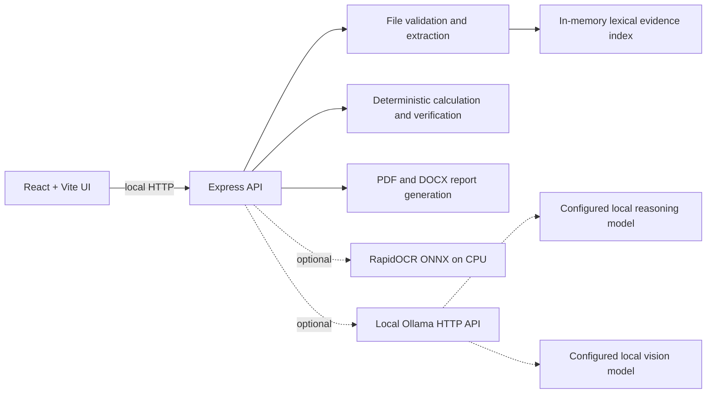

# Architecture

## Runtime components

- The Vite/React client provides the workbench, upload flow, job polling, and
  report links.
- The Express server owns validation, temporary upload handling, extraction,
  analysis jobs, health checks, and report generation.
- CSV, XLSX, DOCX, and machine-readable PDF extraction is implemented in
  `server/services.js`.
- PNG/JPG OCR calls `server/ocr.py`, which loads RapidOCR in the Python
  environment and runs on CPU.
- Retrieval is a small in-memory lexical index. It is not a vector database.
- Pressure calculations run deterministically in JavaScript. Local Ollama
  generation and vision calls are optional adapters rather than requirements
  for the demo path.

## Current boundaries

The API stores active jobs and history in memory, so restarting the server
loses them. Scanned-PDF rendering is not implemented. The demo is simulation
data and must not be treated as an engineering approval. Model availability,
OCR availability, GPU detection, and offline behavior depend on the host
configuration.
